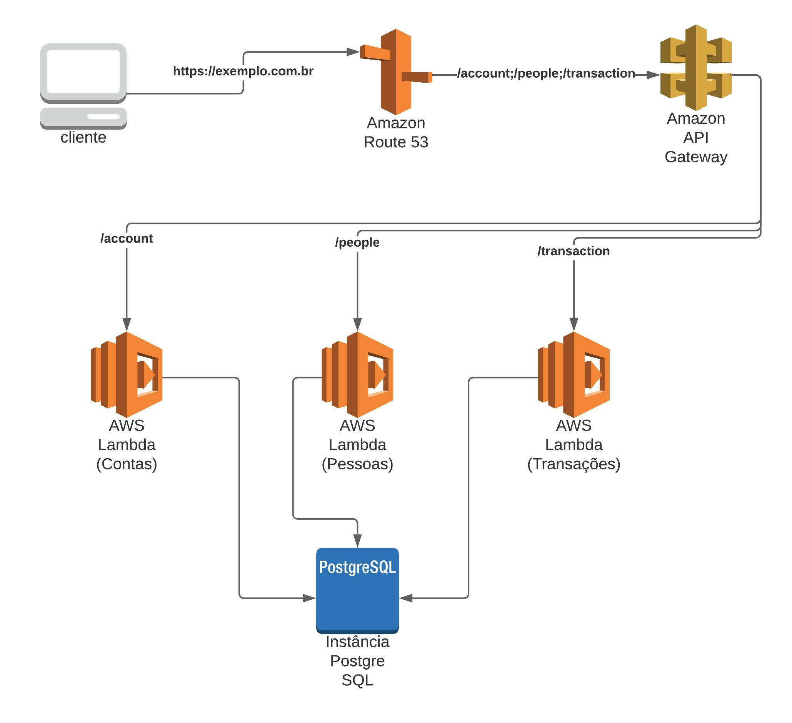

# Proposta para estrutura de micro serviços na AWS

Utilizando a estrutura de lambda da AWS e Circle CI, esse respositório pode estar sendo estruturado da seguinte maneira:

O sistema recebe todas as requisições em um único dominio configurado no `Amazon Route 53`, que direciona para o `Amazon API Gateway`, onde a partir da barra consegue diferenciar qual microsserviço o cliente deseja e direciona. Sendo assim:
- `/account`: Serviço de cliente
- `/people`: Serviço de pessoa
- `/transaction`: Serviço de transação

Todos os microsserviços estão ligados ao mesmo banco de dados, que neste desafio esta utilizando PostgreSQL.